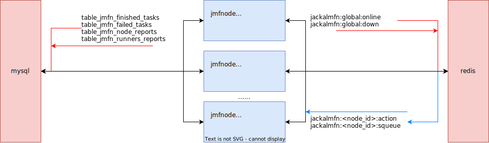

# openJackal Mirrors Fetching Node

### Descriptions

**jmfnode** carries the main syncing and reporting tasks. This part is the fundamental part of the whole openJackal Mirrorstation.

This part is constructed with capabilities of both downloading with multi-thread, and multi-tasks running. It also offers a more safe way to exit without losing tasks unfinished.

You can also use it as a downloader for other purposes.

------

### Build and Run

The following dependencies / environments are required to build and run jmfnode:
+ dependencies:
    + **qt library**: basis of the program
    + **hiredis**: supporting communications with redis
+ environments:
    + **MySQL**: deployed on database server
    + **redis**: deployed on database server
    + **MySQL ODBC Connector**: supporting communications with MySQL

**NOTICE:** the program **HAS NOT** been verified on operating systems other than Windows. (2024/02/23)

------

### traffic flow
